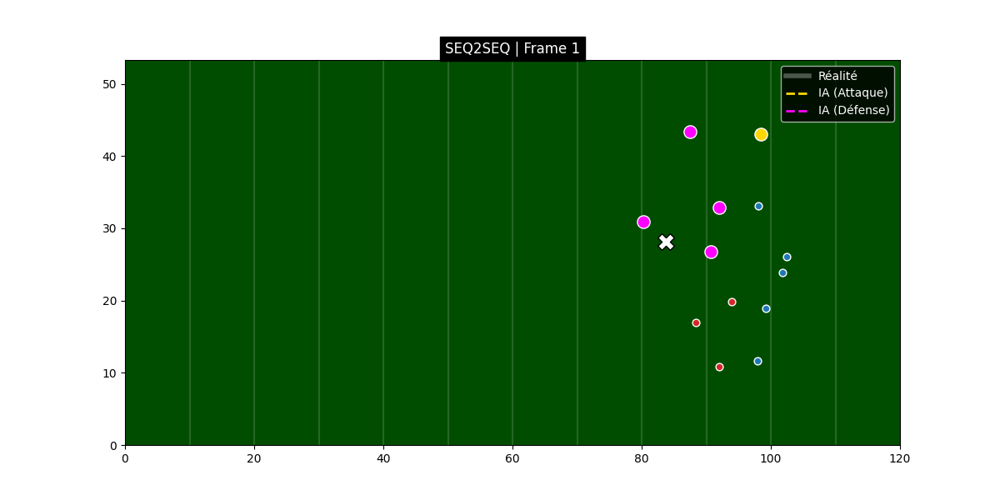

# NFL Prediction : Predict Player Movement During the Downfield Pass

## Overview

This project is realised with the friend [**blajox**](github.com/blajox), during our last year of master's degree. For this project we choose to achieve the problematic brought by the NFL league through their Kaggle competition. This competition focuses on the "crown jewel of American sports", the downfield pass and the critical uncertainty that keeps audiences engaged: will it be a touchdown, an interception, or an incomplete pass?

The objective is to leverage Next Gen Stats data to **predict player movement** during the entire phase when the football is in the air. This analysis is crucial for helping the **NFL** better understand player trajectories and movement patterns during contested catch situations.

---

### The Prediction Challenge

Participants are tasked with building models to predict the precise **location and movement of key players (the targeted receiver and converging defenders)** for every frame, starting the moment the quarterback releases the ball and ending when the ball lands.

#### **Input Information Provided (Pre-Pass Data):**

The data provided for prediction includes information available right up to the moment of ball release:

* **Pre-Pass Tracking Data:** Detailed NGS tracking data leading up to the moment the quarterback releases the ball.
* **Targeted Player:** Identification of the offensive player (the targeted receiver) who is the intended recipient of the pass.
* **Ball Landing Location:** The final $(\text{x}, \text{y})$ coordinates where the pass is expected to land.


#### **Data Details:**

* **Tracking Frequency:** The NFL tracking data is recorded at **10 frames per second (FPS)**.
* **Prediction Granularity:** If a pass is in the air for $T$ seconds, participants must predict **$10 \times T$ frames** of location data for each player.
* **Excluded Plays:** To ensure focus on relevant downfield pass analysis, the competition data **excludes** the following types of plays: quick passes (duration less than 0.5 seconds), deflected passes and throwaway passes.

Note: Due to their size, the input CSV files are not included in this repository. Please download the dataset from the Kaggle Competition Page and place the input_*.csv files in a data/ folder.

link to the data : https://drive.google.com/file/d/1ym1gsHwswDrgso-xznJeHwedd5RBGb5S/view?usp=sharing

#### **Prediction Task:**

Generate models that output predicted movement (location coordinates) for each relevant player across all frames while the **ball is traveling in the air**. The ultimate goal is to generate outputs that **most closely match the actual eventual player movement**.


---

### Getting Started

1.  **Analyze Trajectories:** Use the pre-pass movement data to determine initial velocities and intentions.
2.  **Model Player Intent:** Integrate the knowledge of the Targeted Player and Ball Landing Location, as these heavily influence player movement during the pass.
3.  **Time-Series Modeling:** Develop robust models capable of forecasting multi-step, multi-player time-series data accurately.

## Architecture & Solution

We have developed a Deep Learning model based on a **Transformer Sequence-to-Sequence (Seq2Seq)** architecture. Unlike simple regression models that predict a single final point, our model generates the future trajectory frame-by-frame in an autoregressive manner.

### Key Components:
1.  **Feature Engineering:**
    * **Target Player:** Encoded with historical physics (speed, acceleration, direction) over the last 10 frames.
    * **Social Context:** Integration of the 22 other players on the field relative to the target (Distance, Friend/Foe flag).
2.  **Encoder (Context Understanding):**
    * Uses **Multi-Head Attention** to weigh the importance of each defender and teammate.
    * Creates a "Context Vector" summarizing the tactical situation.
3.  **Decoder (Trajectory Generation):**
    * Predicts the next position $(x, y)$ based on the encoder memory and the previous position.
    * Uses **Positional Encoding** to respect the temporal sequence.

---

## Repository Structure

The project is organized as follows:

```text
nfl-project/
│
├── notebooks/              # Jupyter Notebooks for training and exploration
│   ├── notebook.ipynb   # Initial data analysis
│   └── notebookseq2seq.ipynb # Main training script
│
│
├── models/              # models with trained weights
│   ├── nfl_attention_model_multi_agent.pth   # regressor model with trained weights
│   └── nfl_attention_model_seq2seq.pth # seq2seq model with trained weights
│
├── src/                    # Source code modules
│   ├── dataset.py          # Custom PyTorch Dataset class
│   ├── modelseq2seq.py            # Transformer Seq2Seq Architecture
│   └── visualization.py    # Functions to generate HTML animations
│
├── results/                # Generated visualizations and model weights
│   ├── pred_game_X_play_Y.html  # Interactive trajectory animations
│   └── training_loss.png
│
├── requirements.txt        # Python dependencies
└── README.md               # Project documentation

```


## Results

The model outputs interactive HTML animations comparing the Ground Truth (Real Trajectory) vs AI Prediction.



-----
*Note: This Big Data Bowl 2026 has two competitions. This is the Prediction competition. Learn more about the Analytics competition [here](https://www.kaggle.com/competitions/nfl-big-data-bowl-2026-analytics).*


## Author

Project created by **Antony Manuel** and **Florian Lemiere**, as part of the **IMDA** course.

IMT Nord Europe — **2025–2026**
